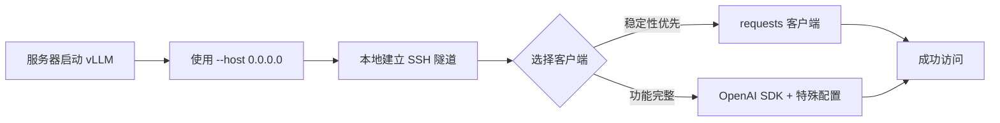

# vLLM 在线服务部署完整指南

> 本文档记录了如何部署 vLLM 在线推理服务，并通过 SSH 隧道实现远程访问的完整流程。

**作者**: AI Assistant & 用户实践总结  
**日期**: 2025-10-05  
**适用场景**: AutoDL 云服务器 + 本地 Windows 客户端

---

## 📋 目录

- [1. 服务器端：启动 vLLM 服务](#1-服务器端启动-vllm-服务)
- [2. 本地端：建立 SSH 隧道](#2-本地端建立-ssh-隧道)
- [3. 客户端访问方案](#3-客户端访问方案)
  - [3.1 方案一：使用 requests 库](#31-方案一使用-requests-库)
  - [3.2 方案二：使用 OpenAI SDK](#32-方案二使用-openai-sdk)
- [4. 问题排查与解决](#4-问题排查与解决)
- [5. 生产级封装](#5-生产级封装)
- [6. 常见问题 FAQ](#6-常见问题-faq)

---

## 1. 服务器端：启动 vLLM 服务

### 1.1 查看服务器公网 IP

```bash
# 在服务器终端执行
curl ifconfig.me
# 输出示例: 1.27.207.191

# 或查看服务器内网 IP
hostname -I
# 输出示例: 172.17.0.3 (Docker 容器内部 IP)
```

### 1.2 启动 vLLM API 服务

```bash
# 在服务器终端执行
vllm serve /root/autodl-tmp/vllm/Qwen/Qwen3-4B \
    --served-model-name Qwen3-4B \
    --api_key muyu \
    --host 0.0.0.0 \
    --port 9000 \
    --trust_remote_code \
    --tensor_parallel_size 1
```

**关键参数说明**：
- `--host 0.0.0.0`：**必须设置！** 监听所有网络接口，允许外部访问
- `--port 9000`：服务端口号
- `--api_key muyu`：API 密钥（可自定义）
- `--tensor_parallel_size 1`：单卡推理

### 1.3 验证服务启动

在**服务器本地**测试：

```bash
# 健康检查
curl http://localhost:9000/health

# 查看模型列表
curl http://localhost:9000/v1/models -H "Authorization: Bearer muyu"
```

---

## 2. 本地端：建立 SSH 隧道

### 2.1 AutoDL 连接信息

```
主机: connect.nmb2.seetacloud.com
端口: 47055
用户: root
密码: 1YjPWsCp267l
```

### 2.2 建立端口映射

在**本地 Windows 命令行**（CMD/PowerShell）中执行：

```powershell
# 建立 SSH 隧道（本地 9000 映射到服务器 9000）
ssh -p 47055 -L 9000:localhost:9000 root@connect.nmb2.seetacloud.com

# 输入密码后，保持终端窗口打开
```

**参数说明**：
- `-p 47055`：SSH 端口
- `-L 9000:localhost:9000`：本地端口:远程主机:远程端口
- 保持终端窗口打开，SSH 隧道才会持续有效

### 2.3 验证隧道连接

在**本地新开一个终端**，测试连接：

```powershell
# 测试健康检查
curl http://localhost:9000/health

# 测试模型列表
curl http://localhost:9000/v1/models -H "Authorization: Bearer muyu"
```

如果返回正常的 JSON 响应，说明隧道建立成功！

---

## 3. 客户端访问方案

### 3.1 方案一：使用 requests 库

**优点**：简单可靠，无兼容性问题  
**缺点**：需要手动构建请求

#### 基础示例

```python
import requests
import json

# 配置
url = "http://localhost:9000/v1/chat/completions"
headers = {
    "Content-Type": "application/json",
    "Authorization": "Bearer muyu"
}

# 构建请求
data = {
    "model": "Qwen3-4B",
    "messages": [{"role": "user", "content": "你好，请介绍一下你自己"}],
    "max_tokens": 512,
    "temperature": 0.7
}

# 发送请求
response = requests.post(url, headers=headers, json=data, timeout=120)
response.raise_for_status()

# 解析响应
result = response.json()
print(f"回复: {result['choices'][0]['message']['content']}")
```

#### 封装版本

```python
import requests
from typing import List, Dict

class VLLMClient:
    """基于 requests 的 vLLM 客户端"""
    
    def __init__(self, base_url: str = "http://localhost:9000", api_key: str = "muyu"):
        self.base_url = base_url.rstrip('/')
        self.headers = {
            "Content-Type": "application/json",
            "Authorization": f"Bearer {api_key}"
        }
    
    def chat(self, message: str, model: str = "Qwen3-4B", max_tokens: int = 512, **kwargs):
        """简单对话"""
        url = f"{self.base_url}/v1/chat/completions"
        data = {
            "model": model,
            "messages": [{"role": "user", "content": message}],
            "max_tokens": max_tokens,
            **kwargs
        }
        response = requests.post(url, headers=self.headers, json=data, timeout=120)
        response.raise_for_status()
        return response.json()['choices'][0]['message']['content']
    
    def chat_with_history(self, messages: List[Dict], model: str = "Qwen3-4B", max_tokens: int = 512, **kwargs):
        """多轮对话"""
        url = f"{self.base_url}/v1/chat/completions"
        data = {
            "model": model,
            "messages": messages,
            "max_tokens": max_tokens,
            **kwargs
        }
        response = requests.post(url, headers=self.headers, json=data, timeout=120)
        response.raise_for_status()
        return response.json()['choices'][0]['message']['content']

# 使用示例
client = VLLMClient()
response = client.chat("你好")
print(response)
```

---

### 3.2 方案二：使用 OpenAI SDK

**优点**：标准接口，功能完整（支持流式输出等）  
**缺点**：需要特殊配置才能在 SSH 隧道环境下工作

#### ⚠️ 问题与解决方案

**问题现象**：
- 使用默认配置时，OpenAI 客户端返回 `502 Bad Gateway` 错误
- requests 库正常工作，但 OpenAI SDK 失败

**根本原因**：
- `httpx` 库（OpenAI SDK 底层使用）的连接管理机制与 SSH 隧道存在兼容性问题
- 默认的连接池复用策略在隧道环境下会导致连接状态不一致

**解决方案**：配置 `httpx` 使用不保持连接的策略

#### ✅ 正确的配置方式

```python
from openai import OpenAI
import httpx

# 关键：完整的连接管理配置（四项缺一不可）
http_client = httpx.Client(
    timeout=120.0,
    limits=httpx.Limits(
        max_keepalive_connections=0,  # 不保持长连接
        max_connections=100,           # 最大连接数
        keepalive_expiry=0             # 连接立即过期
    ),
    transport=httpx.HTTPTransport(retries=0)  # 禁用自动重试
)

client = OpenAI(
    base_url="http://localhost:9000/v1",
    api_key="muyu",
    http_client=http_client
)

# 使用
completion = client.chat.completions.create(
    model="Qwen3-4B",
    messages=[{"role": "user", "content": "你好，请介绍一下你自己"}],
    max_tokens=512,
    temperature=0.7
)

print(completion.choices[0].message.content)
```

**配置说明**：
| 参数 | 作用 | 为什么必须 |
|------|------|-----------|
| `max_keepalive_connections=0` | 不保持长连接 | 避免复用失效的隧道连接 |
| `max_connections=100` | 限制最大连接数 | 与上一项配合，防止配置冲突 |
| `keepalive_expiry=0` | 连接立即过期 | 确保每次都是新连接 |
| `HTTPTransport(retries=0)` | 禁用自动重试 | 避免重试失败的连接 |

⚠️ **注意**：这四项配置**必须同时存在**，缺少任何一项都会导致 502 错误！

#### 完整封装版本

```python
from openai import OpenAI
import httpx
from typing import List, Dict, Iterator

class VLLMClientWithOpenAI:
    """基于 OpenAI SDK 的 vLLM 客户端（支持 SSH 隧道）"""
    
    def __init__(
        self,
        base_url: str = "http://localhost:9000",
        api_key: str = "muyu",
        model: str = "Qwen3-4B",
        timeout: float = 120.0
    ):
        self.model = model
        
        # 关键配置：完整的连接管理参数
        http_client = httpx.Client(
            timeout=timeout,
            limits=httpx.Limits(
                max_keepalive_connections=0,
                max_connections=100,
                keepalive_expiry=0
            ),
            transport=httpx.HTTPTransport(retries=0)
        )
        
        self.client = OpenAI(
            base_url=f"{base_url}/v1",
            api_key=api_key,
            http_client=http_client
        )
    
    def chat(self, message: str, max_tokens: int = 512, temperature: float = 0.7, **kwargs) -> str:
        """简单对话"""
        completion = self.client.chat.completions.create(
            model=self.model,
            messages=[{"role": "user", "content": message}],
            max_tokens=max_tokens,
            temperature=temperature,
            **kwargs
        )
        return completion.choices[0].message.content
    
    def chat_with_history(self, messages: List[Dict], max_tokens: int = 512, temperature: float = 0.7, **kwargs) -> str:
        """多轮对话"""
        completion = self.client.chat.completions.create(
            model=self.model,
            messages=messages,
            max_tokens=max_tokens,
            temperature=temperature,
            **kwargs
        )
        return completion.choices[0].message.content
    
    def chat_stream(self, message: str, max_tokens: int = 512, temperature: float = 0.7, **kwargs) -> Iterator[str]:
        """流式对话"""
        stream = self.client.chat.completions.create(
            model=self.model,
            messages=[{"role": "user", "content": message}],
            max_tokens=max_tokens,
            temperature=temperature,
            stream=True,
            **kwargs
        )
        
        for chunk in stream:
            if chunk.choices[0].delta.content:
                yield chunk.choices[0].delta.content
    
    def close(self):
        """关闭客户端"""
        self.client.close()

# 使用示例
client = VLLMClientWithOpenAI()

# 普通对话
response = client.chat("你好")
print(response)

# 流式输出
for chunk in client.chat_stream("讲个故事"):
    print(chunk, end="", flush=True)

client.close()
```

---

## 4. 问题排查与解决

### 4.1 常见错误诊断

#### 错误 1：`Connection refused`

**现象**：
```
curl: (7) Failed to connect to localhost port 9000: Connection refused
```

**原因**：
1. vLLM 服务未启动
2. SSH 隧道未建立
3. 端口号不匹配

**解决**：
1. 检查服务器上 vLLM 服务是否运行
2. 检查 SSH 隧道是否正常（终端是否关闭）
3. 确认端口号一致

---

#### 错误 2：`502 Bad Gateway`（OpenAI SDK）

**现象**：
```python
openai.InternalServerError: Error code: 502
```

**原因**：
- OpenAI SDK 的 httpx 配置不完整
- 连接池复用策略与 SSH 隧道冲突

**解决**：
使用完整的 httpx 配置（四项参数缺一不可）：

```python
http_client = httpx.Client(
    timeout=120.0,
    limits=httpx.Limits(
        max_keepalive_connections=0,
        max_connections=100,
        keepalive_expiry=0
    ),
    transport=httpx.HTTPTransport(retries=0)
)
```

---

#### 错误 3：`OSError: [Errno 99] Cannot assign requested address`

**现象**：
```
OSError: [Errno 99] Cannot assign requested address
```

**原因**：
vLLM 启动时 `--host` 参数设置错误，尝试绑定不存在的 IP

**解决**：
```bash
# ❌ 错误：绑定公网 IP
vllm serve ... --host 1.27.207.191

# ✅ 正确：绑定所有接口
vllm serve ... --host 0.0.0.0
```

---

#### 错误 4：`finish_reason=length`（输出被截断）

**现象**：
模型输出很短就停止了

**原因**：
`max_tokens` 参数太小，或者没有设置（默认值只有 16）

**解决**：
```python
# 明确设置 max_tokens
completion = client.chat.completions.create(
    model="Qwen3-4B",
    messages=[{"role": "user", "content": "你好"}],
    max_tokens=512  # ← 必须设置！
)
```

---

### 4.2 诊断工具

#### 测试脚本

```python
import requests
from openai import OpenAI
import httpx

print("=" * 60)
print("测试 1: 使用 requests（应该成功）")
print("=" * 60)
try:
    response = requests.post(
        "http://localhost:9000/v1/chat/completions",
        headers={"Content-Type": "application/json", "Authorization": "Bearer muyu"},
        json={"model": "Qwen3-4B", "messages": [{"role": "user", "content": "测试"}], "max_tokens": 50},
        timeout=60
    )
    print(f"✅ requests 成功: {response.status_code}")
except Exception as e:
    print(f"❌ requests 失败: {e}")

print("\n" + "=" * 60)
print("测试 2: 使用纯 httpx")
print("=" * 60)
try:
    with httpx.Client(timeout=60.0) as client:
        response = client.post(
            "http://localhost:9000/v1/chat/completions",
            headers={"Content-Type": "application/json", "Authorization": "Bearer muyu"},
            json={"model": "Qwen3-4B", "messages": [{"role": "user", "content": "测试"}], "max_tokens": 50}
        )
        print(f"✅ httpx 成功: {response.status_code}")
except Exception as e:
    print(f"❌ httpx 失败: {e}")

print("\n" + "=" * 60)
print("测试 3: 使用 OpenAI 客户端（带正确配置）")
print("=" * 60)
try:
    http_client = httpx.Client(
        timeout=60.0,
        limits=httpx.Limits(max_keepalive_connections=0, max_connections=100, keepalive_expiry=0),
        transport=httpx.HTTPTransport(retries=0)
    )
    client = OpenAI(base_url="http://localhost:9000/v1", api_key="muyu", http_client=http_client)
    completion = client.chat.completions.create(
        model="Qwen3-4B", messages=[{"role": "user", "content": "测试"}], max_tokens=50
    )
    print(f"✅ OpenAI 客户端成功")
except Exception as e:
    print(f"❌ OpenAI 客户端失败: {e}")
```

---

## 5. 生产级封装

### 5.1 完整的客户端类

保存为 `vllm_client.py`：

```python
"""
vLLM 客户端封装 - 支持 SSH 隧道环境
提供 requests 和 OpenAI SDK 两种实现方式
"""

import requests
from openai import OpenAI
import httpx
from typing import List, Dict, Iterator, Optional, Literal

class VLLMClient:
    """
    vLLM 统一客户端
    支持两种后端：'requests'（推荐用于稳定性）或 'openai'（推荐用于功能完整性）
    """
    
    def __init__(
        self,
        base_url: str = "http://localhost:9000",
        api_key: str = "muyu",
        model: str = "Qwen3-4B",
        backend: Literal['requests', 'openai'] = 'requests',
        timeout: float = 120.0
    ):
        """
        初始化客户端
        
        Args:
            base_url: vLLM API 服务地址
            api_key: API 密钥
            model: 模型名称
            backend: 后端实现 ('requests' 或 'openai')
            timeout: 请求超时时间（秒）
        """
        self.base_url = base_url.rstrip('/')
        self.api_key = api_key
        self.model = model
        self.backend = backend
        self.timeout = timeout
        
        if backend == 'openai':
            # OpenAI SDK 后端（需要特殊配置）
            http_client = httpx.Client(
                timeout=timeout,
                limits=httpx.Limits(
                    max_keepalive_connections=0,
                    max_connections=100,
                    keepalive_expiry=0
                ),
                transport=httpx.HTTPTransport(retries=0)
            )
            self._openai_client = OpenAI(
                base_url=f"{base_url}/v1",
                api_key=api_key,
                http_client=http_client
            )
        else:
            # requests 后端
            self._headers = {
                "Content-Type": "application/json",
                "Authorization": f"Bearer {api_key}"
            }
    
    def chat(
        self,
        message: str,
        max_tokens: int = 512,
        temperature: float = 0.7,
        top_p: float = 0.95,
        **kwargs
    ) -> str:
        """简单对话"""
        messages = [{"role": "user", "content": message}]
        return self.chat_with_history(messages, max_tokens, temperature, top_p, **kwargs)
    
    def chat_with_history(
        self,
        messages: List[Dict[str, str]],
        max_tokens: int = 512,
        temperature: float = 0.7,
        top_p: float = 0.95,
        **kwargs
    ) -> str:
        """多轮对话"""
        if self.backend == 'openai':
            completion = self._openai_client.chat.completions.create(
                model=self.model,
                messages=messages,
                max_tokens=max_tokens,
                temperature=temperature,
                top_p=top_p,
                **kwargs
            )
            return completion.choices[0].message.content
        else:
            url = f"{self.base_url}/v1/chat/completions"
            data = {
                "model": self.model,
                "messages": messages,
                "max_tokens": max_tokens,
                "temperature": temperature,
                "top_p": top_p,
                **kwargs
            }
            response = requests.post(url, headers=self._headers, json=data, timeout=self.timeout)
            response.raise_for_status()
            return response.json()['choices'][0]['message']['content']
    
    def chat_stream(
        self,
        message: str,
        max_tokens: int = 512,
        temperature: float = 0.7,
        top_p: float = 0.95,
        **kwargs
    ) -> Iterator[str]:
        """流式对话（仅 OpenAI 后端支持）"""
        if self.backend != 'openai':
            raise NotImplementedError("流式输出仅支持 'openai' 后端")
        
        stream = self._openai_client.chat.completions.create(
            model=self.model,
            messages=[{"role": "user", "content": message}],
            max_tokens=max_tokens,
            temperature=temperature,
            top_p=top_p,
            stream=True,
            **kwargs
        )
        
        for chunk in stream:
            if chunk.choices[0].delta.content:
                yield chunk.choices[0].delta.content
    
    def close(self):
        """关闭客户端"""
        if self.backend == 'openai':
            self._openai_client.close()

# 使用示例
if __name__ == "__main__":
    # 方式1：使用 requests 后端（推荐，最稳定）
    client = VLLMClient(backend='requests')
    response = client.chat("你好")
    print(f"requests 后端: {response}")
    
    # 方式2：使用 OpenAI 后端（支持流式输出）
    client_openai = VLLMClient(backend='openai')
    response = client_openai.chat("你好")
    print(f"OpenAI 后端: {response}")
    
    # 流式输出
    print("流式输出: ", end="", flush=True)
    for chunk in client_openai.chat_stream("讲个笑话", max_tokens=200):
        print(chunk, end="", flush=True)
    print()
    
    client_openai.close()
```

---

## 6. 常见问题 FAQ

### Q1: 为什么 requests 能用，但 OpenAI SDK 不行？

**A**: 因为 `httpx` 库（OpenAI SDK 底层）的连接池管理机制与 SSH 隧道存在兼容性问题。需要配置 `max_keepalive_connections=0` 等参数来禁用连接复用。

---

### Q2: 必须使用 SSH 隧道吗？

**A**: 不一定。如果你的云服务器：
- **开放了公网端口**：可以直接访问 `http://公网IP:9000`
- **没有开放公网端口**：必须使用 SSH 隧道

AutoDL 等云服务需要手动配置端口映射，所以推荐使用 SSH 隧道。

---

### Q3: OpenAI SDK 配置的四个参数必须全部设置吗？

**A**: 是的！经过实际测试：
- 只设置 `max_keepalive_connections=0` → **失败**（502）
- 完整设置四个参数 → **成功**

这四个参数形成了完整的"不保持连接"策略，缺一不可。

---

### Q4: 推荐使用哪种客户端？

**A**: 根据需求选择：

| 场景 | 推荐方案 | 原因 |
|------|---------|------|
| 生产环境稳定性优先 | **requests** | 简单可靠，无兼容性问题 |
| 需要流式输出 | **OpenAI SDK** | 原生支持 stream |
| 快速原型开发 | **requests** | 更少的配置 |
| 与现有 OpenAI 代码集成 | **OpenAI SDK** | 接口一致 |

---

### Q5: 如何验证配置是否正确？

**A**: 运行诊断脚本（见 4.2 节），如果三个测试都通过，说明配置完全正确。

---

## 7. 总结

### 7.1 完整流程回顾



### 7.2 关键要点

1. **服务器端**：必须使用 `--host 0.0.0.0`
2. **SSH 隧道**：端口映射格式 `-L 本地端口:localhost:远程端口`
3. **requests 客户端**：开箱即用，无需特殊配置
4. **OpenAI SDK**：必须完整配置 httpx 的四个参数
5. **max_tokens**：必须显式设置，默认值太小（16）

### 7.3 参考文档

- [vLLM 官方文档](https://docs.vllm.ai/)
- [OpenAI API 文档](https://platform.openai.com/docs/api-reference)
- [httpx 文档](https://www.python-httpx.org/)

---

**文档维护**：如有问题或改进建议，请及时更新本文档。
